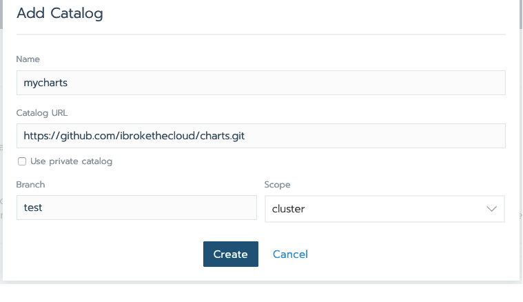
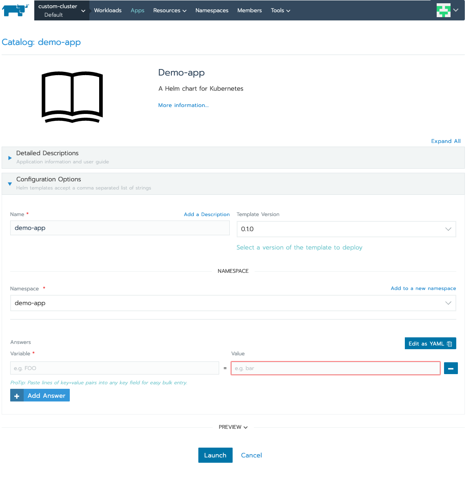
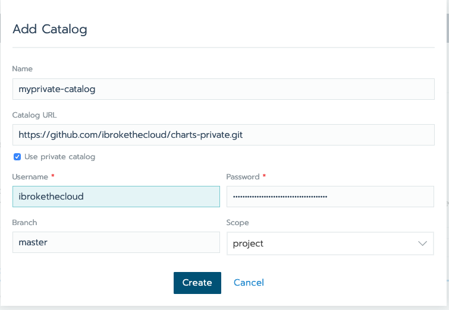
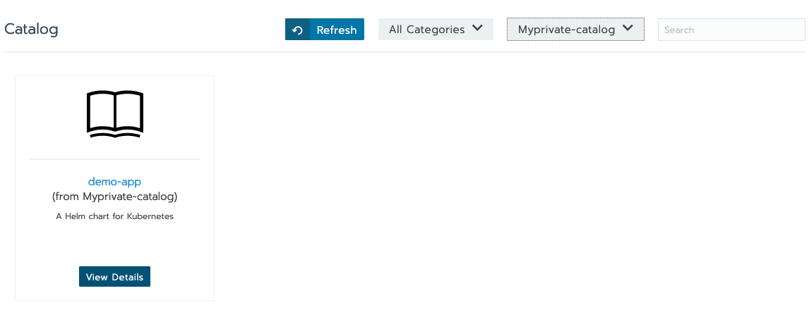

## Setting up custom catalogs

This tutorial aims at showing the flow for setting a custom catalog on Rancher, and using the same to deploy workloads.

Rancher allows Catalogs to be setup at the following levels:
* Global: Catalog items are available to all clusters managed by the rancher master.
* Cluster: Catalog items are only available to all the projects managed under the specified cluster.
* Project: Catalog items are only available to all the namespaces in the specified project.

Using these scope's the development teams can easily setup their deployment pipelines using the catalog.

For example, common logging and monitoring charts could be made available to all the clusters.

Cluster specific charts such as ingress setup, could be restricted to the cluster scope.

While specific workloads specific charts could be limited to the Project level.

Rancher supports the use of git repos as catalogs.

The repos' can be both public or private.

We will cover both examples of private and public repos.

#### Public repos
Public repos are easier to setup as there is no auth requirement when setting up the catalog.

Users just need to go to the **Tools -> Catalog** item and click on "Add Catalog"

Provide Catalog details:

Rancher will referesh the catalog and in a few seconds the repo should be active:

Since our catalog scope was cluster, we can use this in any project on the cluster.

For the purpose of this example we will select the demo-app from our recently added catalog repo.

We will just use the defaults:

And in a few seconds the app should be deployed and ready.

#### Private Repos

For private repos the process is the same, except we need to select the "Use Private Catalog" option while adding the Catalog.

For this example I have cloned my original **charts** repo into a **charts-private** repo.

Again for this second example we specify the Catalog to be avaialble only to the Project.

We can now provide our credentials.

For github repos, we can use a Personal Access Token for authentication.

Once the catalog has been refreshed it is ready for use, and we can deploy our trusted **demo-app** from the catalog.

##### Additional information
Catalog items are basically helm charts.

For details on learning how to write helm charts please refer to the official [documentation.](https://helm.sh/docs/developing_charts/)