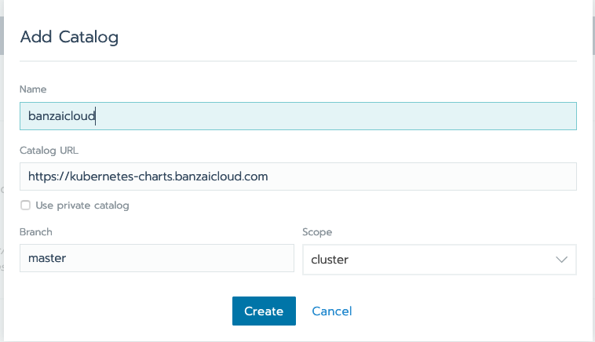
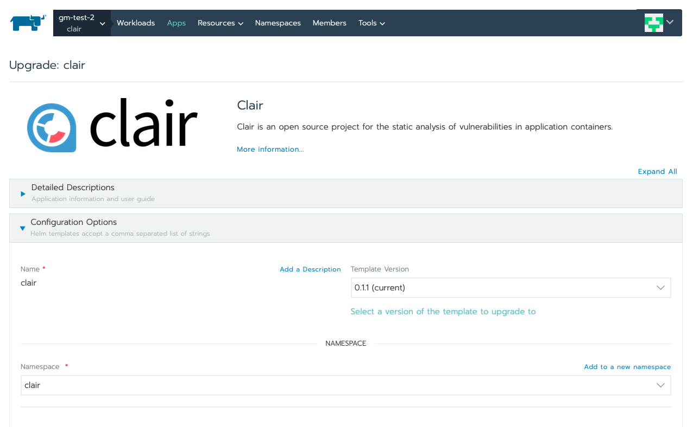
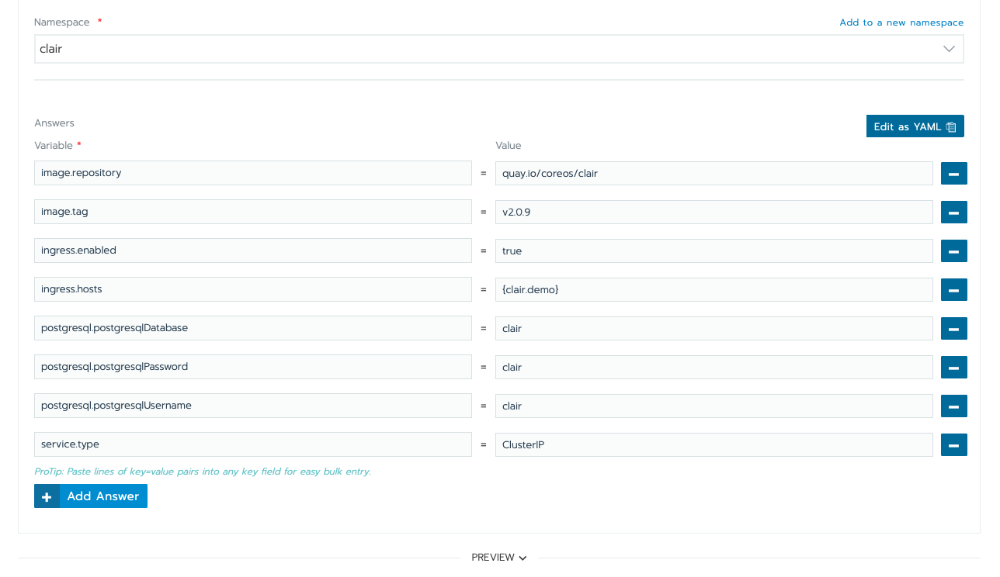

## Setting up container scanning

This guide is intended to provide an example on how to setup container scanning infrastructure on K8S.

There are a lot of products, opensource and paid which can be used to perform scanning on the container images.

For the purpose of this demo we will be using CoreOS [clair.](https://github.com/coreos/clair)

Clair can perform static analysis of vulnerabilities in the application containers.

Once clair is deployed, the users can use the API calls to perform scanning of container images or one of the readily available CLI integrations.

Additional details of the most popular integrations can be found [here.](https://github.com/coreos/clair/blob/master/Documentation/integrations.md)

For the purpose of this example we will be using **klar**

We will start first by deploying Clair to our K8S cluster.

A clair helm chart is already available in (BanzaiCharts)[https://github.com/banzaicloud/banzai-charts]

We can add the Banzai charts helm repo as a catalog to our cluster:



After a few seconds this should be available to use


The clair helm chart runs a postgres sql database for persistence.

We can either disable persistence from the chart settings, or can use a Persistent Volume Claim.

For production grade environments it is advisable to setup persistence.

This can be done via the volume settings in the Rancher UI.

The PVC name needed by the helm chart is **data-clair-postgresql-0**


We are now ready to deploy the helm chart.


We will be overriding the following settings in the helm chart:


* ingress.enabled
* ingress.hosts
* service.type
* postgresql.postgresqlUsername
* postgresql.postgresqlDatabase
* postgresql.postgresqlPassword
* image.repository
* image.tag


These settings ensure that ingress is allowed to the clair service and on a predefined hostname.

**NOTE:** The postgresql value overrides are a workarond to handle the change in dependency chart for postgresql.

The fully deployed clair workload should look something like this.


#### Setting up the cli: klar
We can install [klar](https://github.com/optiopay/klar) by either following the install instructions on the project page, or just using one of the precompiled packages.

klar needs the following environment variables to be setup.

**CLAIR_ADDR** To point to the clair endpoint. In our example it will be `clair.demo:80`

```
▶ export CLAIR_ADDR=http://clair.demo:80
```

Now the scan can be run as follows:

```
▶ klar alpine
clair timeout 1m0s
docker timeout: 1m0s
no whitelist file
Analysing 1 layers
Got results from Clair API v1
Found 0 vulnerabilities
```

```
▶ klar ubuntu
clair timeout 1m0s
docker timeout: 1m0s
no whitelist file
Analysing 4 layers
Got results from Clair API v1
Found 27 vulnerabilities
Negligible: 9
Low: 11
Medium: 7
```


Please note that klar can only scan the images once they are available in the docker registry.

klar cli can be easily integrated into image build pipelines to scan the image once it has been built.

The CI step should take care to remove the image if the scan fails or make sure that the build artefact cannot be promoted