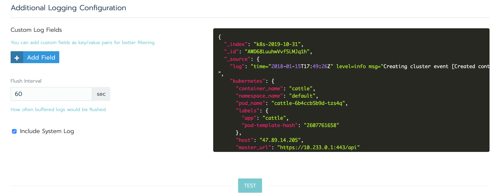
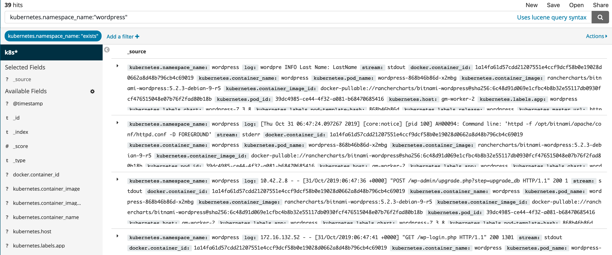

## Setting up logging on K8S example

This guide is intended to provide an example of how to setup a simple logging stack on K8S.

Rancher itself can integrate with a number of common logging solutions.

The logging can be setup at the cluster level or per project level.

We will enable the logging at the Cluster scope. 

The same steps can also be performed at the Project scope as well.

Rancher supports out of box integration with Elasticsearch, Splunk, Kafka, Syslog and Fluentd.

For the purpose of this example we will use the Elasticsearch integration.

We need to specify a few mandatory fields:

* endpoint for Elasticsearch
* prefix for index name.

Once the fields are specified, we can **TEST** the integration and **Save** the changes.

After the changes are done, we can go to the Kibana search interface for our Elasticsearch instance, and visualise the cluster logs.

Since the logging was enabeld at cluster scope we can see logs for all projects in our cluster.

