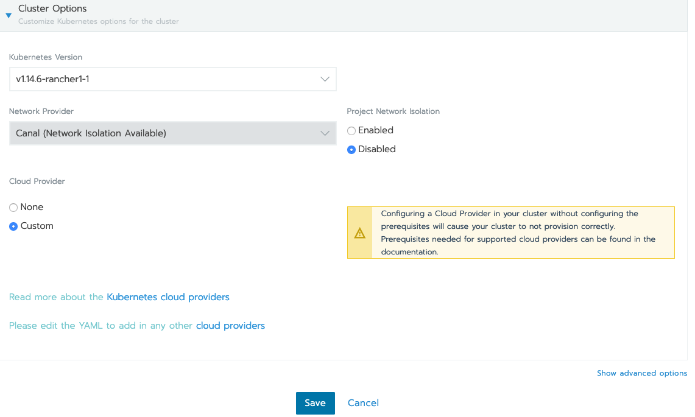
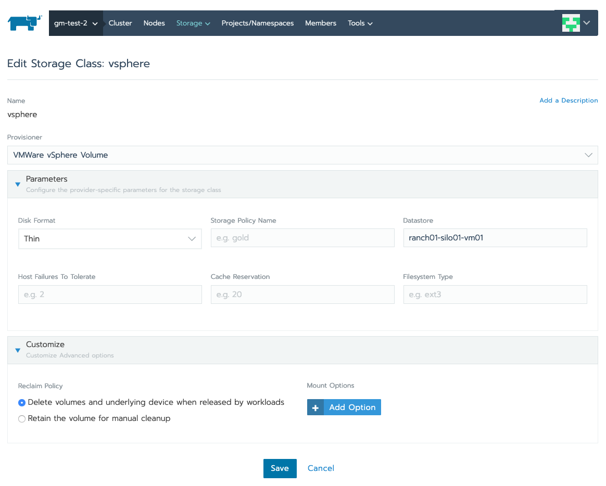
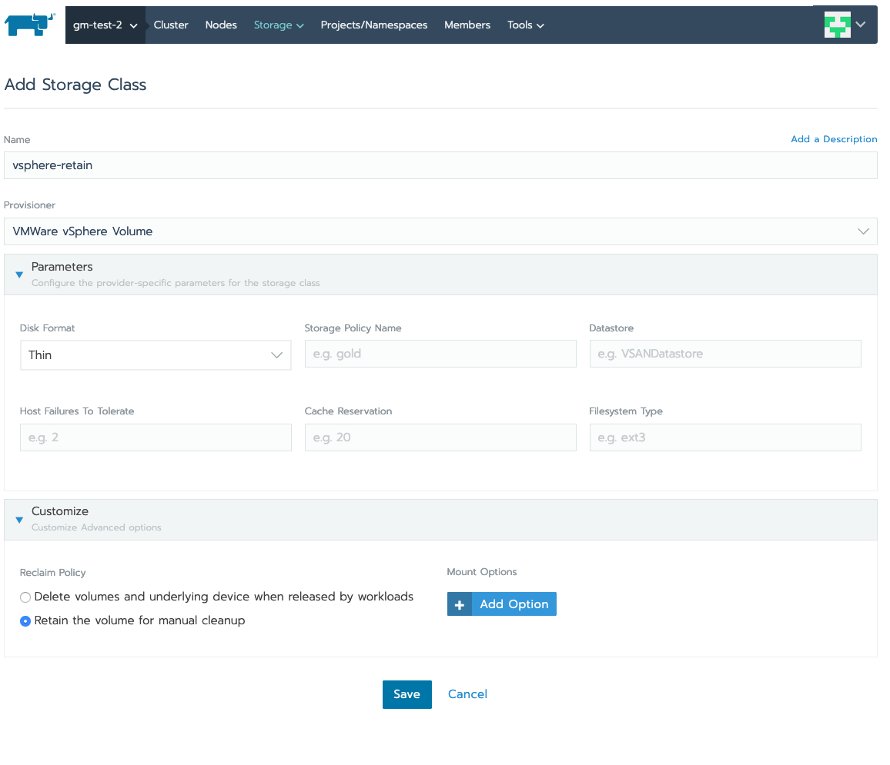
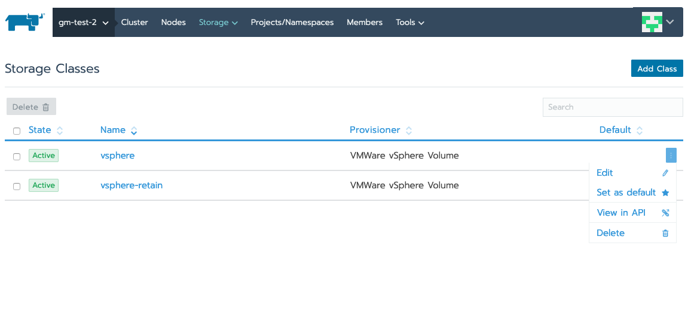
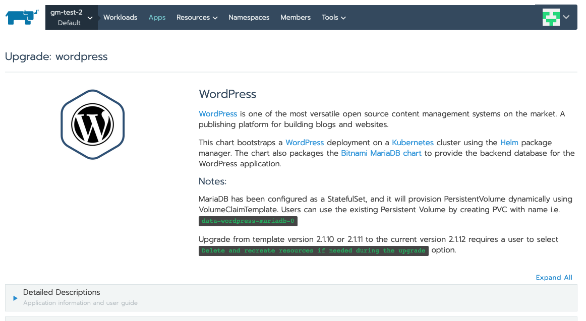
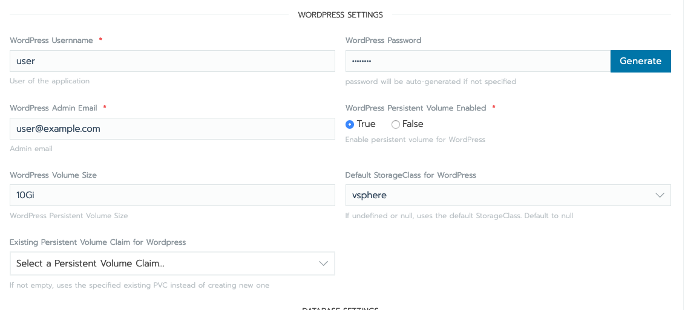
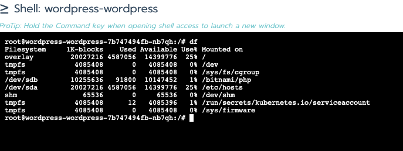
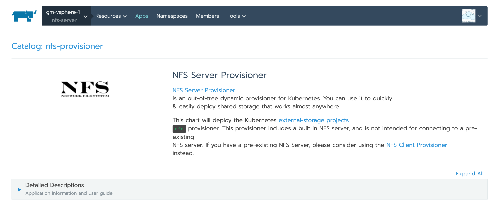
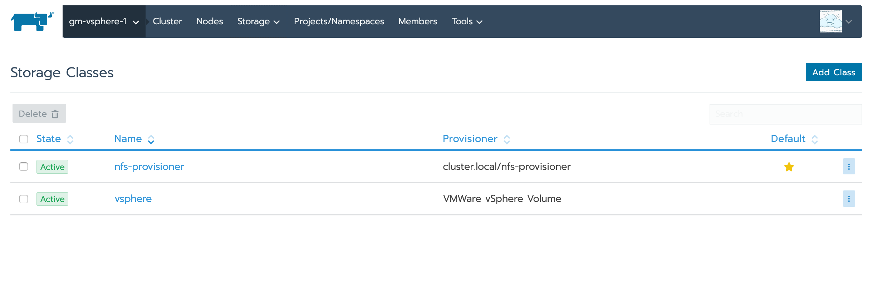
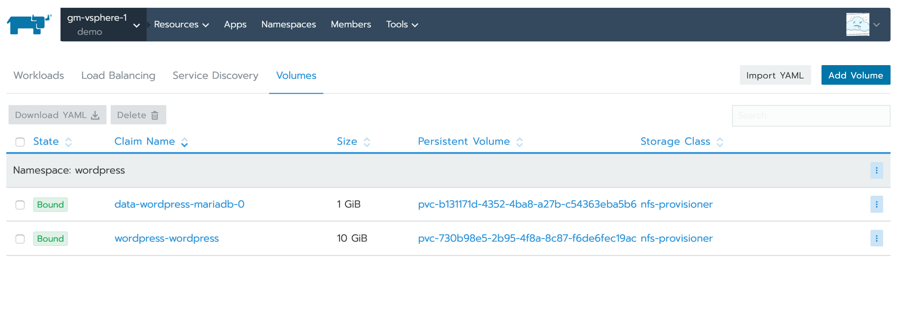

### Persistence for stateful workloads

Stateful workloads in K8S may have a requirement for storing state or configuration for persistence from pod failures.

K8S allows workloads with such requirements to use Persistent Volumes to allow such information to be stored on a separate volume provisioned from the cloud provider, which can then be attached across pod failures. 

This tutorial will cover one such scenario and illustrate how persistent volumes can be used to accomplish this.

To be able to use persistent volumes, the cluster administrator needs to configure the **cloud provider** when setting up the cluster.

This can be done from the Rancher UI, at the cluster level by Editing the cluster, and updating the YAML to provide the details of the cloud provider.

For the purpose of this example we will use the vsphere provider.

Once the vsphere cloud provider has been setup in the cluster yaml, the users can proceed with creating the storage classes:

We will define two storage classes for this example:

**vsphere** storage class, which has a reclaim policy to delete volumes when it is released by the workload.

**vsphere-retain** storage class, which has a reclaim policy that retains the volumes after the workload has released it.

If needed the cluster administrator can now setup either storage class as a default class. This is useful for cases  when no explicity storage class is specified in the PVC, the cluster can switch to the default one.

We will now deploy a sample wordpress workload using these storage classes.
We can use the wordpress app available in the catalog.

We will be updating the wordpress settings in the app, to ensure we turn on Persistent Volumes and specify the storage class to be used by wordpress.

We proceed with the vsphere storage class.

After we launch the app, we should see an event in the workload requesting a volume, and eventually a volume is attached. 

We can verify the volume in the volumes section of the workload.

It takes a few seconds for the wordpress workload to be deployed.

Once deployed we can login to the pod and see the extra volume mounted under /bitnami/php/

All changes to this mount should persist across pod failures.

#### NFS Storage provider
We will provide a second storage class, which can be easily setup for demo's and if needed eventually fine tuned for long running persistence.

We can deploy the NFS storage provisioner from the rancher library.

Please note that at the time of writing this document this library helm chart is **Experimental** and should not be used for any production grade workloads.

The chart is available in the catalog:

For the purpose of this demo, we will continue with the default values in the chart:

**NOTE:** If you are using RancherOS for the Worker nodes, then please ensure that the NFS Host Path is /mnt. 

Deploying this chart will create a new storage class at the cluster scope which can now be used by the workloads.

**Note**: The default settings of the chart do not enable persistence. If you need persistence then this needs to be setup based on your storage requirements.

Now we can redeploy the wordpress helm chart using this NFS provisioner storage driver:

Once the workload is deployed we should see two new PVC claims using the new nfs provisioner.

This example shows a simple use case of having persistence. 

Users are advised to look at their workload requirements when deciding on the setup for the storage classes.