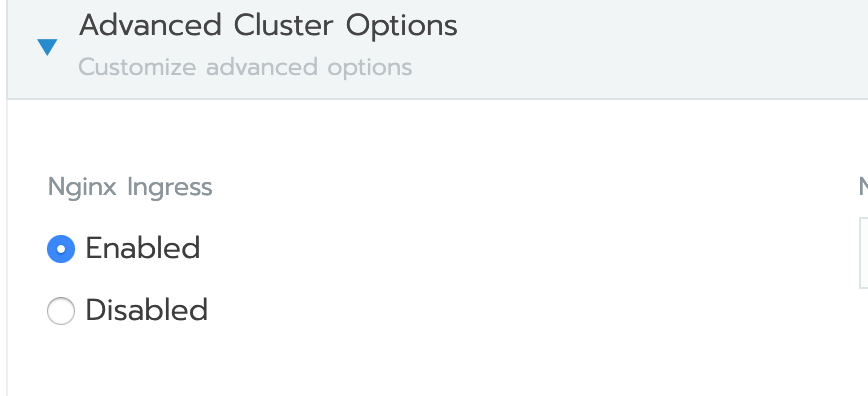
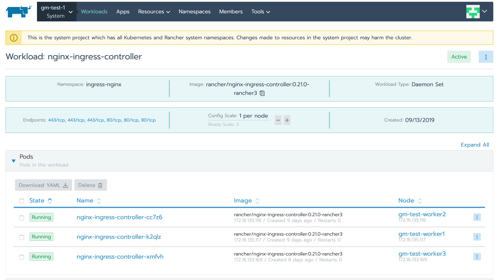
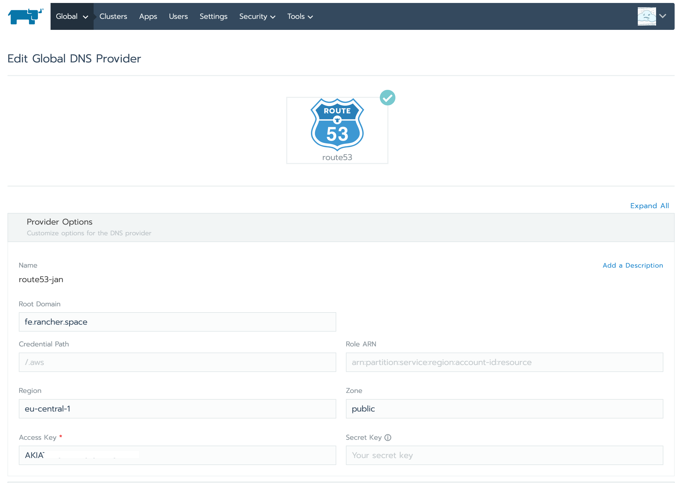
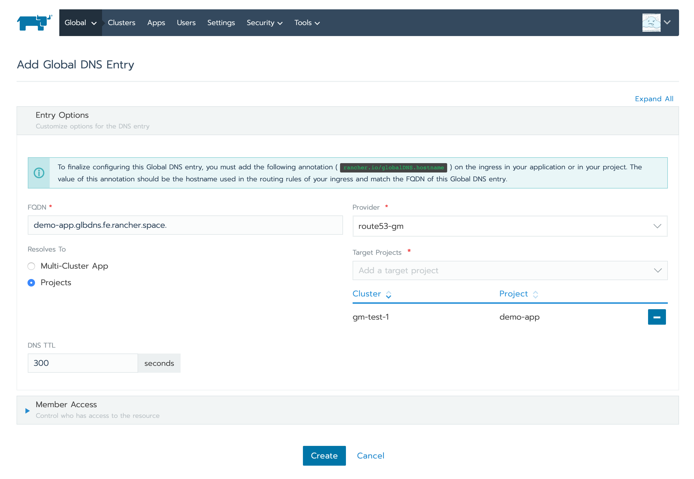
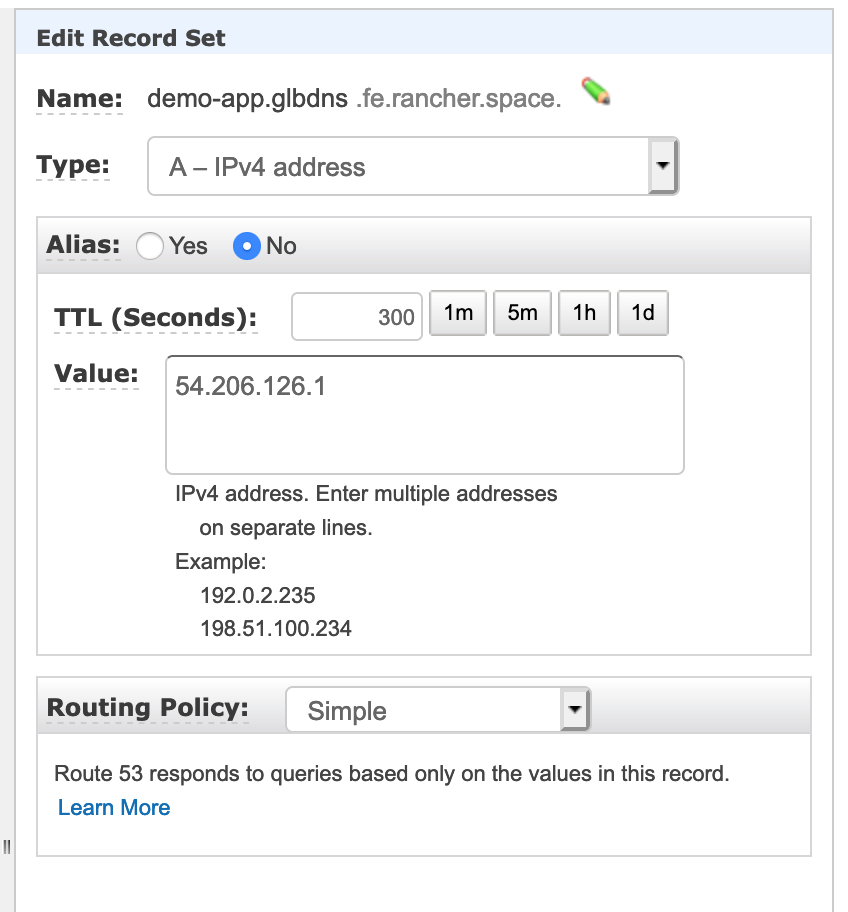
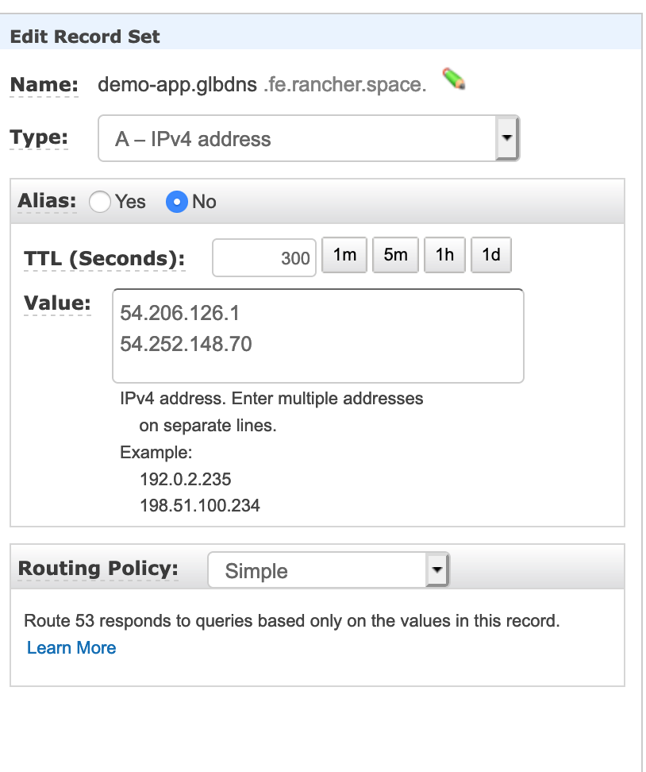

Ingress in K8S exposes the http and https routes from outsdie the cluster to services within the cluster.

To be able to use the ingress resource the cluster must have an ingress controller enabled.

For the purpose of this example we will be using the Nginx Ingress controller which can be easily enabled from the Rancher UI.



This should deploy a daemonset for nginx ingress controller on all your worker nodes.

The pods can be viewed in the **ingress-nginx** namespace:

```shell
$ kubectl get pods -n ingress-nginx -o wide
NAME                                    READY   STATUS    RESTARTS   AGE   IP               NODE              NOMINATED NODE   READINESS GATES
default-http-backend-5954bd5d8c-wld2q   1/1     Running   0          12d   10.42.1.7        gm-test-worker1   <none>           <none>
nginx-ingress-controller-cc7z6          1/1     Running   0          8d    172.16.135.118   gm-test-worker2   <none>           <none>
nginx-ingress-controller-k2qlz          1/1     Running   0          8d    172.16.135.117   gm-test-worker1   <none>           <none>
nginx-ingress-controller-xmfvh          1/1     Running   0          8d    172.16.133.169   gm-test-worker3   <none>           <none>

```

When deployed from Rancher this namespace gets mapped into the **System** project.



Now that we have ingress configured we are ready to setup a demo app to consume this ingress resource.

We can use the sample chart available [here](https://github.com/ibrokethecloud/charts/tree/master/demo-app) for the purpose of testing.

The rendered ingress spec is as follows:

```yaml
# Source: demo-app/templates/ingress.yaml
apiVersion: extensions/v1beta1
kind: Ingress
metadata:
  name: demo-app
  labels:
    app.kubernetes.io/name: demo-app
    helm.sh/chart: demo-app-0.1.0
    app.kubernetes.io/instance: demo-app
    app.kubernetes.io/version: "1.0"
    app.kubernetes.io/managed-by: Tiller
  annotations:
    kubernetes.io/ingress.class: nginx

spec:
  rules:
    - host:
      http:
        paths:
          - path: /demo
            backend:
              serviceName: demo-app
              servicePort: http

```

This configures the ingress controller to route all requests for the uri `/demo` to the service `demo-app`.

The annotation `kubernetes.io/ingress.class: nginx` is used to specify the ingress controller to use.

Users may want to run multiple ingress controllers, for example in a multi-tenant environment to ensure that ingress can be managed by each of the tenants.

In that case the users need to ensure that the correct ingress controller is specified.

Once the ingress is applied, the ingress specification can be view via kubectl:

```shell
$ kubectl get ingress
NAME       HOSTS   ADDRESS                                        PORTS   AGE
demo-app   *       172.16.133.169,172.16.135.117,172.16.135.118   80      4m37s
```

Or via Rancher:


Our app can now be accessed via any of the ingress hosts using any valid hostname at the uri **/demo**.

We can change this behaviour by updating the ingress controller to match specific hostnames only:

```yaml
# Source: demo-app/templates/ingress.yaml
apiVersion: extensions/v1beta1
kind: Ingress
metadata:
  name: demo-app
  labels:
    app.kubernetes.io/name: demo-app
    helm.sh/chart: demo-app-0.1.0
    app.kubernetes.io/instance: demo-app
    app.kubernetes.io/version: "1.0"
    app.kubernetes.io/managed-by: Tiller
  annotations:
    kubernetes.io/ingress.class: nginx

spec:
  rules:
    - host: demo.local
      http:
        paths:
          - path: /demo
            backend:
              serviceName: demo-app
              servicePort: http

```

We have added the extra **host** match directive - `host: demo.local`.

As a result of this the ingress controller will now ally the path matching rules only when the host header matches **demo.local**.

The ingress reflects this change now:

```shell
$ kubectl get ingress
NAME       HOSTS        ADDRESS                                        PORTS   AGE
demo-app   demo.local   172.16.133.169,172.16.135.117,172.16.135.118   80      19m
```

Now that we have covered ingress, we can look at how DNS can now be used along with the ingress spec.

We can use the **Global-DNS** option available within Rancher for this.

To use Global DNS we need to first configure a DNS provider. For purpose of this demo, we are going to use AWS Route 53:



Once this is done we can configure a global-dns record, and map it a multi-cluster app or a project.

For this example we will just use the **demo-app** project on our cluster:



Once created, we should see an entry:


Once the base setup is done we need to deploy the helm chart with the extra annotations on the ingress spec:

```yaml
apiVersion: extensions/v1beta1
kind: Ingress
metadata:
  name: demo-app
  labels:
    app.kubernetes.io/name: demo-app
    helm.sh/chart: demo-app-0.1.0
    app.kubernetes.io/instance: demo-app
    app.kubernetes.io/version: "1.0"
    app.kubernetes.io/managed-by: Tiller
  annotations:
    kubernetes.io/ingress.class: nginx
    rancher.io/globalDNS.hostname: demo-app.glbdns.fe.rancher.space

spec:
  rules:
    - host: "demo-app.glbdns.fe.rancher.space"
      http:
        paths:
          - path: /demo
            backend:
              serviceName: demo-app
              servicePort: http
```

The spec now has an extra annotation:

```rancher.io/globalDNS.hostname: demo-app.glbdns.fe.rancher.space```

Which matches the Host matching rule on the ingress controller.

Once the workload is deployed, the GlobalDNS controller picks up the workload, and creates a DNS record in route53 matching the IP of the worker nodes running the workload:



matches worker node:


The benefit of using a Global DNS controller is that DNS records are kept upto date to match the ingress nodes.

For example we scaled our node pool:


and that gets reflected in the DNS record as well:


