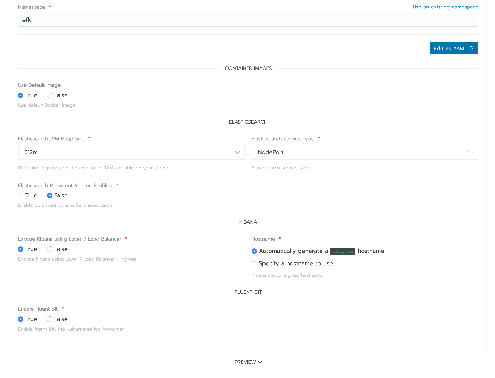
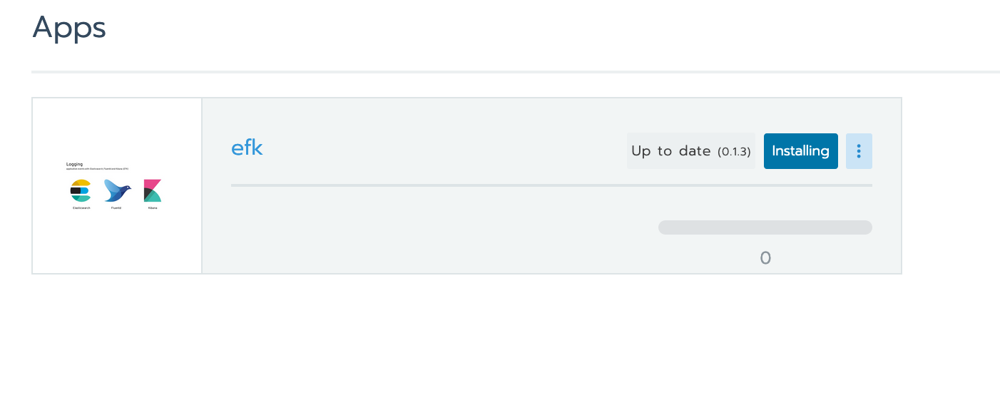

This guide is intended to provide an example of how to setup a simple logging stack on K8S and use Rancher to setup log forwarding to that cluster

## Setup EFK stack

We can choose one of the options available in the helm stable catalog, and development / operation teams are free to chose one which works for their use case scenario:

For the purpose of this demo we already have a K8S cluster running and managed by Rancher.

We have setup a logging project to deploy this on the cluster, as this eventually helps with RBAC to managing the workload at a K8S layer.

For the purpose of this demo I will be choosing the ElasticSearch+FluentBit+Kibana stack:

There are few customisations available in the app, which need to be configured on the use case:

Because we will be using Rancher to manage log forwarding, we want to disbale FileBeat in this Helm chart by setting "Enable Filebeat" to "False":

There are some key items to note:

* The app will spin up 3 elasticsearch pods, so based on the number of worker nodes or how ingress needs to be managed to elasticsearch the team may need to decide if they prefer to use NodePort or ClusterIP.

For the purpose of this example, we have used ClusterIP

* The front end for viewing logs is via Kibana, which can be customised further. One key customisation to note of is the **hostname** to use to access Kibana.

The hostname is used to setup the ingress rule on thee ingress controller:

For the purpose of this demo we use ***logging.demo**

* The users may also want to choose how to manage persistence for ElasticSearch. This can be easily achieved by using persistent volume claims. For the purpose of this demo we will not be changing this.

We simply now click **Launch** and this should launch the catalog app into the logging project under a new namespace named **efk**:

Users can now follow the status of the EFK rollout, and in a few mins you should have all the logging components deployed:

Users can also now verify the ingress spec to allow access to Kibana:

Kibana can now be accessed by pointing the broweser to http://logging.demo

As part of the Kibana / ElasticSearch configuration, at first time the user will need to specify an index pattern to use from ElasticSearch:

Once this initial setup the users can search for logs from the cluster using Kibana:

This document hopefully shows how easy it is to setup a logging stack of your choice using the wide variety of community curated helm charts.

This document is intended to be a quick start reference guide as we used most of the common defaults.

For production grade logging stacks, the users need to decide on factors such as:

- log retention duration
- persistence
- rate of log ingestion, which in turn impacts elasticsearch JVM heap sizing.

## Configure Log Forwarding

Rancher itself can integrate with a number of common logging solutions.

The logging can be setup at the cluster level or per project level.

We will enable the logging at the Cluster scope.

The same steps can also be performed at the Project scope as well:

Rancher supports out of box integration with Elasticsearch, Splunk, Kafka, Syslog and Fluentd.

For the purpose of this example we will use the Elasticsearch integration:

We need to specify a few mandatory fields:

* endpoint for Elasticsearch
* prefix for index name.

Once the fields are specified, we can **TEST** the integration and **Save** the changes.

After the changes are done, we can go to the Kibana search interface for our Elasticsearch instance, and visualise the cluster logs:

Since the logging was enabled at cluster scope we can see logs for all projects in our cluster.

## Viewing Log Output

Now that we have setup a logging stack and configured Rancher to foward logs, we can see log events from demo-app which just servces a static hello world page with a randomised delay.

The container logs can be viewed in the Rancher UI:

The users can now go and search the same logs in the Kibana frontend as well:

