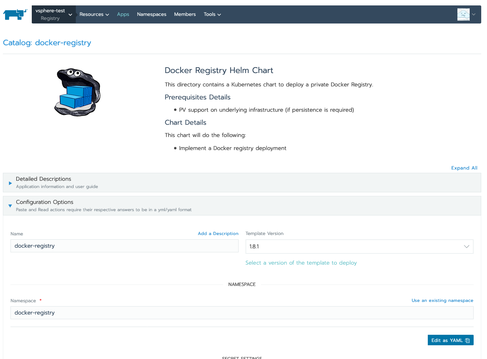
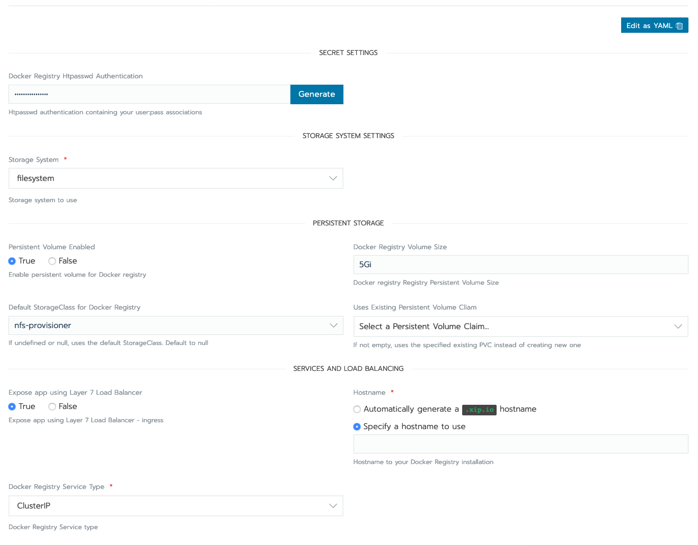

For the purpose of this example we will be using the docker registry helm chart available in the catalog.


A docker registry needs to have persistent storage available to store the container image layers.

The docker registry needs a persistent store for storing container images, unless this registry is only for testing purposes.

The list of supported docker registry drivers is available [here](https://docs.docker.com/registry/storage-drivers/).

For the purpose of this demo we will use the **FileSystem** driver, which allows the registry to use a local file system.

The helm chart needs a Persistent Volume for use with the FileSystem option.

The chart requires that the persistent volume is already available before the chart is deployed.

The users need to ensure that the appropriate cloud credentials are available for use in your K8S cluster.

For the purpose of this example we will use the NFS storage provisioner. Details on how to install the same can be found [here](360041579132).

Another pre-requisite for the docker-registry is an authentication user and password.

This can be easily created using the existing **registry** container image.

For this example we will create a user named **demo** which can authenticate with the password **demopassword**:

```bash
docker run --entrypoint htpasswd registry:2 -Bbn demo demopassword > htpasswd
```

This password can now be used in the variable updates for the chart.

We will use the docker-registry chart from the rancher charts library:



We need to update a few settings:



Specify the username:password combination generated from the `htpasswd` command in the **Docker Registry Htpasswd Authentication** field.

We will select the `nfs-provisioner` storage class.

We will also specify a hostname to use in the L7 load balancer ingress specificiation, example: registry.yourdomain.com

Now launching the app will deploy the docker-registry to a docker-registry namespace.

In case you are using a self signed certificate, then please ensure that the insecure-registries on your local docker-daemon are setup to include the newly setup registry. In this particular case **registry.yourdomain.com**

To verify the registry, we will login to the registry using the username / password we setup in the htpasswd file:

```shell
$ docker login -u demo registry.yourdomain.com
Password:
Login Succeeded
```

We can now push an image to this registry. We will just use an existing image for this test and re-tag it:

```bash
docker tag alpine:latest registry.yourdomain.com/alpine:latest
```

Now the push should be successful:

```shell
$ docker push registry.local/alpine:latest
The push refers to repository [registry.local/alpine]
03901b4a2ea8: Pushed
latest: digest: sha256:acd3ca9941a85e8ed16515bfc5328e4e2f8c128caa72959a58a127b7801ee01f size: 528
```
